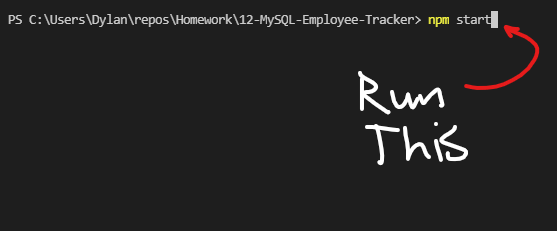
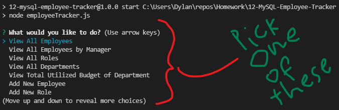
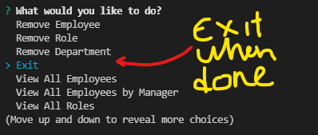

# 12-MySQL-Employee-Tracker

## Description

This app is for managing a company's employees using node, inquirer, and MySQL.

##  Link to A video "demonstrating the entirety of the app's functionality"

https://youtu.be/st_Mb_UiueY

## Usage

You must run the Schema file in mysql workbench and optionally seed the database as well.

## Screenshots

## Contact

### Email

Dylan Cole <logboarddjc@gmail.com>

## License

MIT License

Copyright (c) [2021] [Dylan Cole]   